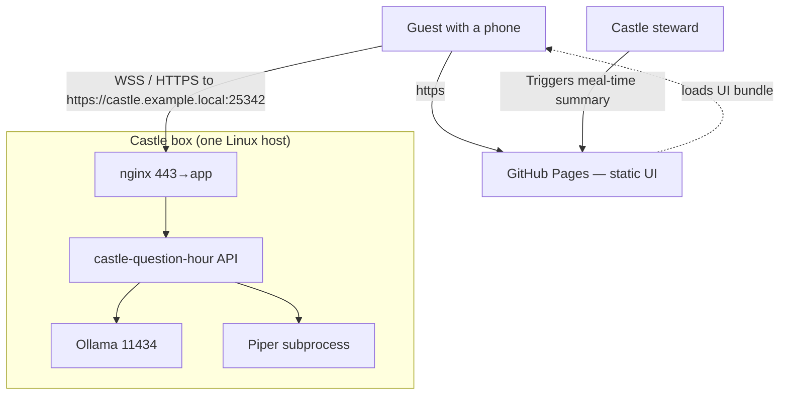

# Architecture

A C4-flavored map of the system. Mermaid sources below; if your viewer doesn't
render them, the ASCII fallback at the end is canonical.

## C4: System context



## C4: Container

```mermaid
flowchart LR
    subgraph "Phone (Chromium/Safari)"
      UI[Vite + React app]
      SW[Service Worker]
      YD[Y.Doc in IndexedDB]
      UI <--> SW
      UI <--> YD
    end

    UI <-- "Yjs over WebRTC mesh" --> UI2[other phones]
    UI <-- "REST + WS signaling" --> N[nginx]
    SW <-- "Web Push" --- N
    N -- "/api/v1, /healthz, /readyz" --> A[Go backend]
    A --> O[Ollama HTTP]
    A --> T[Piper subprocess]
```

## Where the data lives

| Datum                                  | Phone | Backend | Notes                                       |
|----------------------------------------|:-----:|:-------:|---------------------------------------------|
| Question of the hour (text)            |   ✓   |    ✓    | Pulled by the phone; backend authoritative. |
| Anonymous answer text                  |   ✓   |    —    | Stays on the WebRTC mesh. Never on disk on backend by default. |
| Push subscription endpoints            |   —   |    ✓    | Required for fan-out. Optional SQLite persistence. |
| Theme summary (when steward triggers)  |   ✓   |   transient | Backend posts answers to LLM, returns themes + WAV, then forgets. |
| Castle code                            |   ✓   |    ✓    | The backend tracks it for routing; phones store it in localStorage. |

The most important property: **the backend never holds answer text at rest**.
Phones publish answers to a Yjs CRDT that's gossiped peer-to-peer. The backend
only ever sees answer content when the steward explicitly POSTs a payload to
`/summarize`, at which point it's piped through Ollama and discarded.

## Hour timeline

```
 :00 ┌─────────────────────────────────────────────────────────┐
     │ scheduler fires → picks a question per castle           │
     │ → SetQuestion()  → push.NotifyCastle()                  │
     │ → service workers wake → showNotification()             │
     │                                                         │
 :01 │ phones open the app → /api/v1/castle/{code}/now         │
     │ → answer drafted → appended to Y.Array on Y.Doc         │
     │ → gossipped over mesh to peers in this castle           │
     │                                                         │
 :30 │ steward clicks "Make summary" on their phone            │
     │ → frontend reads Y.Array.toArray()                      │
     │ → POST /api/v1/castle/{code}/summarize                  │
     │ → Ollama returns 3-7 themes JSON                        │
     │ → Piper renders the spoken paragraph as WAV             │
     │ → frontend plays the WAV                                │
     │                                                         │
 :59 │ end of hour; next bucket starts at :00                  │
     └─────────────────────────────────────────────────────────┘
```

## ASCII fallback for the C4 container view

```
[Phones]──Yjs/WebRTC mesh──[Phones]
   │                          │
   ├──── REST / WSS ──────────┤
   ▼                          ▼
[nginx :443/25342]
   │
   ▼
[castle-question-hour :8080]──HTTP──>[ollama :11434]
   │
   └──spawn──>[piper subprocess]
```

## Module boundaries (Go)

See [ADR 0008](adr/0008-go-layout.md) for the full table. The summary:

- `castle/` owns per-room state — never imports `signaling`, `push`, or HTTP.
- `signaling/` knows about WebSockets and `castle.Registry` only.
- `schedule/` knows about `castle.Registry`, the question `Bank`, and a `Pusher` interface.
- `push/` knows about VAPID and `castle.Castle` (subscriptions). No HTTP layer.
- `summarize/` is a pure HTTP client to Ollama; no shared state.
- `tts/` is a subprocess/HTTP wrapper for Piper; no shared state.
- `httpapi/` is the only package that knows about chi, routes, JSON wire shape, CORS.

If a future change makes one of these packages depend on another in a way that
breaks the table above, write a new ADR before doing it.
